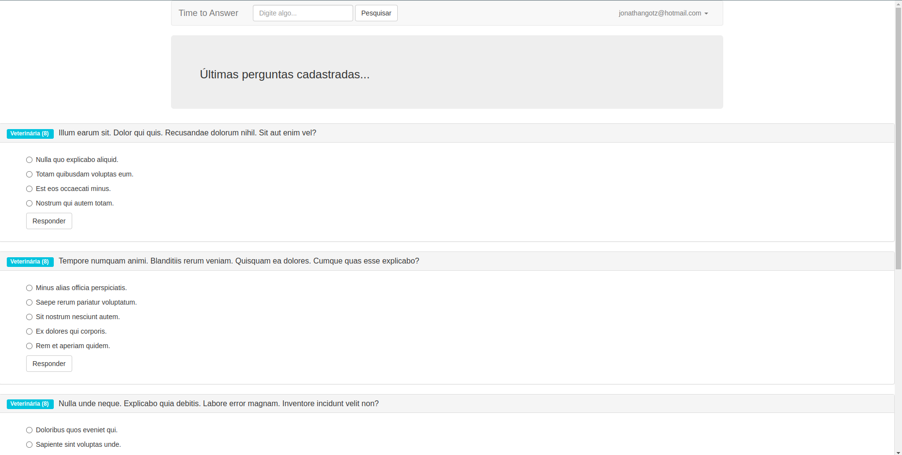
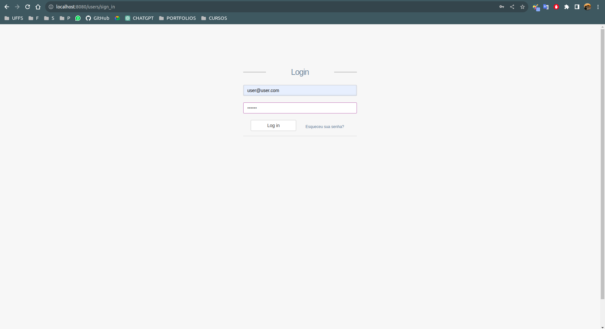
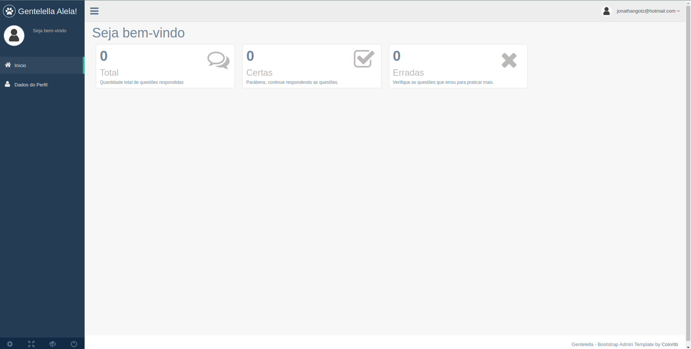
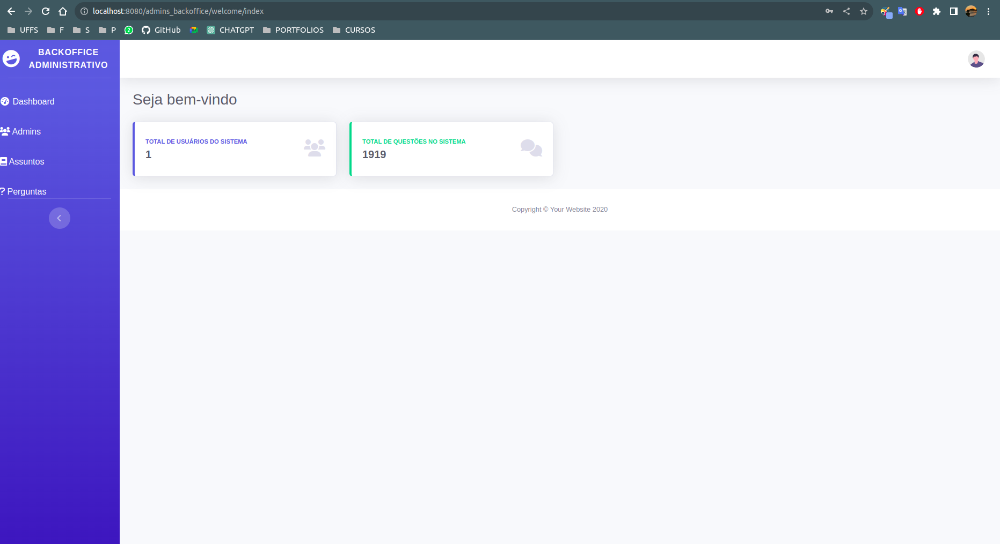

<br />

<h1 align="center" style="text-align: center;">Time to Answer</h1>

<p align="center">
	<a href="https://github.com/Jonagotz">
		
	</a>
	<a href="#">
		
	</a>
	<a href="hhttps://github.com/Jonagotz/SiteRuby/stargazers">
		
	</a>
	<a href="https://github.com/Jonagotz/SiteRuby/network/members">
		
	</a>
	<a href="https://github.com/Jonagotz/SiteRuby/graphs/contributors">
		
	</a>
</p>

<p align="center">
	<b>Manage yourself a system of questions and answers!</b><br />
	<span>Created with Ruby on Rails and other web languages to improve my skills as developer full stack.</span><br />
	<sub>Made with pasion</sub>
</p>

<br />






<br />

> # :warning: Note
> This project was made as a online class to understand the Ruby on Rails framework with Docker so i could start to work for Solidus Smart organization, I didint finish all the classes so the code is incomplete, i maybe can improve this project in the future to let it running fine!
<br />

# :pushpin: Contents

- [Features](#rocket-features)
- [Installation](#wrench-installation)
- [Getting started](#bulb-getting-started)

# :rocket: Features

- Create questions, with subjects and right answers.
- Create users e admin users.
- Manage the counting of right and wrong answers.
- Manage how much questions exist.

# :wrench: Installation

### Required :warning:
- Postgres
- Docker

### SSH

SSH URLs provide access to a Git repository via SSH, a secure protocol. If you have an SSH key registered in your GitHub account, clone the project using this command:

```git clone git@github.com:Jonagotz/SiteRuby.git```

### HTTPS

In case you don't have an SSH key on your GitHub account, you can clone the project using the HTTPS URL, run this command:

```git clone https://github.com/Jonagotz/SiteRuby.git```

**Both of these commands will generate a folder called SiteRuby, with all the project**

# :bulb: Getting started

### Server

1. Open the terminal on the project and run ```docker compose up -d``` to start the docker container and install the dependencies
2. run ```docker -it curso zsh``` (if you don't have installed zsh, use bash) and then run ```rails dev:setup``` to start creating generate users, admin users, and questions (a lot)
3. If all goes well, access the url ```http://localhost:8080/``` to open the development server on port 3000
4. to access the admin dashboard, the url ```http://localhost:8080/admins/sign_in```
